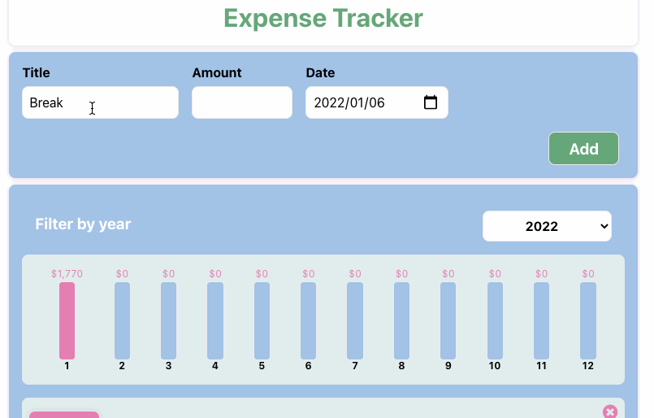

# Expense Tracker
[Demo site](https://bacnotes.github.io/react-expense-tracker/ "Demo site")  

## Features
What you can do is to
- Add expense with `Title`, `Amount` and `Date`
- Check total monthly expense of the year by dropdowns
- Delete expense by click `x` btn

## Use
- React, Sass, sweetalert2, uuid
